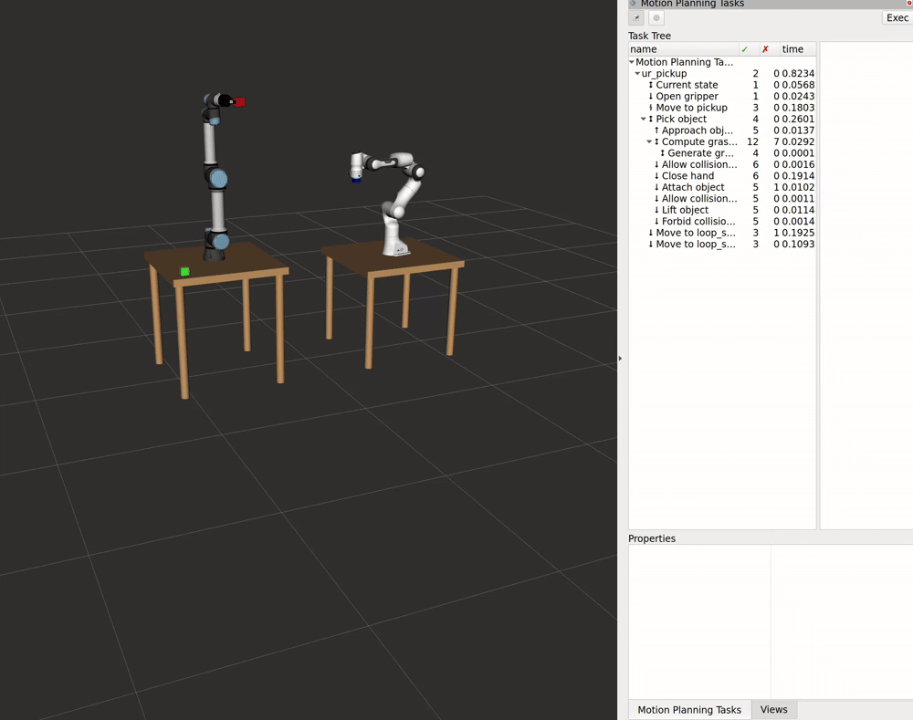
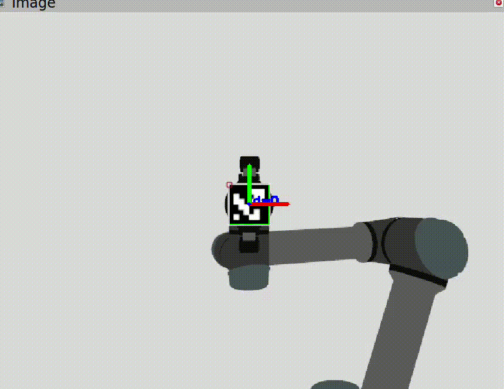
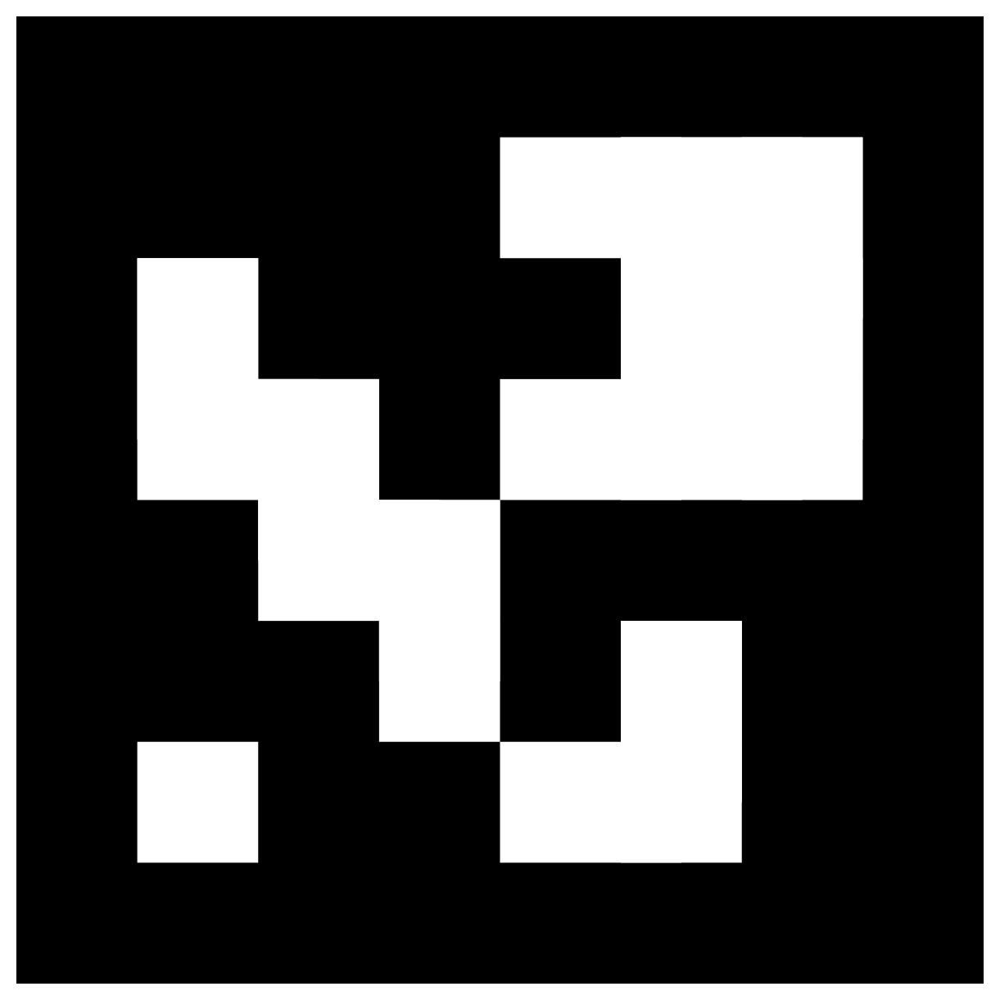

# Dual Arm Position-based Visual Servoing

This project aims to create a dual arm system comprising of a UR5e and an FER manipulator. The UR5e picks up a target object with an Aruco marker and moves it in a continuous loop while the FER keeps a constant relative pose with the target object using eye-in-hand pose tracking.

---

## Technological Stack

- **Docker:** For easier operability on different devices
- **Github Actions:** For checking builds
- **Gazebo Sim Harmonic:** Used for simulating the robots as well as the Aruco marker
- **Moveit2:** For motion planning and inverse kinematics
- **OpenCV:** For Aruco marker detection
- **ROS2 Jazzy Jalisco:** Used as the communication framework

---

## Usage
The following steps need to be performed:
1. Complete the [post installation steps for Docker](https://docs.docker.com/engine/install/linux-postinstall/) and allow connections to the host's X server.
    ```
    xhost +local:docker
    ```
2. Clone the project repository.
    ```
    git clone https://github.com/ShUbHkHaNdElWaL493/Visual-Guided-Decentralized-Two-Arm-Synchronization.git vgdtas
    cd vgdtas
    ```
3. Start up the container using `docker compose`. If you don't have a GPU, remove the `deploy` block from `docker-compose.yaml` and try again.
    ```
    docker compose up --build -d
    ```
4. Launch `env.launch.py` in a terminal.
    ```
    docker exec -it vgdtas "ros2 launch vgdtas_tasks env.launch.py"
    ```
5. Once the Rviz interface has booted up completely and the Moveit and Moveit Servo nodes have completed their setup, launch `tasks.launch.py` in another terminal.
    ```
    docker exec -it vgdtas "ros2 launch vgdtas_tasks tasks.launch.py"
    ```

---

## Progress
The following things have been done:
1. The Moveit and Moveit Servo nodes operate perfectly, ensuring no issue in command generation and forwarding.
2. The tasks execute perfectly with the eye-in-hand pose tracking working correctly for FER with the Aruco marker.
3. The target pose generation algorithm works perfectly when the motion is in a 2-D plane but fails in the x-axis due to an inaccurate frame of reference. This is due to a change in the frame of reference during creation of the Gazebo camera.

---

## Implementation

<div align="center">
    <figure>
    
    <figcaption><em>Scene</em></figcaption>
    </figure>
</div>

<div style="text-align: center;">
    <figure style="display: inline-block; vertical-align: top; margin-right: 20px;">
        
        <figcaption><em>Camera</em></figcaption>
    </figure>
    <figure style="display: inline-block; vertical-align: top;">
        
        <figcaption><em>Aruco marker</em></figcaption>
    </figure>
</div>